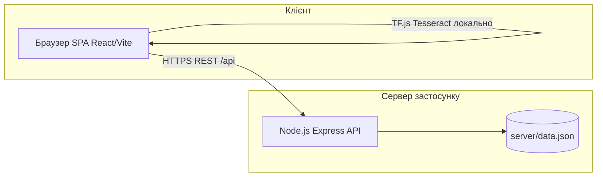

# AI Transparency Media Lab

Веб-застосунок для інтелектуального аналізу медіаконтенту з анімованою візуалізацією результатів розпізнавання об’єктів та тексту.

## Про проєкт

Дипломна робота на тему «Інформаційна система інтелектуального аналізу медіаконтенту з анімованою візуалізацією результатів розпізнавання об’єктів».

Обробка AI-моделей (OCR, класифікація, детекція) виконується в браузері (TensorFlow.js, Tesseract.js). Облікові записи, історія дій та обране зберігаються на власному backend (Node.js + JSON-файл), авторизація — JWT.

## Архітектура та складові системи

### Структурні елементи

| Компонент | У проєкті | Примітка |
|-----------|-----------|----------|
| Веб-сервер (HTTP) | Так | У розробці: Vite dev server (порт 5173) роздає SPA та проксує `/api` на API. У production: Nginx, Caddy або інший reverse proxy — статика з `dist/` та проксування `/api` → Node. |
| Application server | Так | Node.js + Express (`server/`) — REST API, JWT, bcrypt. |
| СУБД (класична) | Ні | PostgreSQL/MySQL не використовуються. |
| Персистентні дані | Файл `server/data.json` | Користувачі, історія, обране; для лабораторної це файлове сховище замість СУБД. Можна замінити на БД без зміни контракту API. |
| Файлове сховище | Так | Дані додатку — `server/data.json`; шлях задається `DATABASE_PATH` у `.env`. |
| Кешування (Redis тощо) | Ні | Не передбачено. Статичні асети можуть кешуватися на рівні CDN/веб-сервера. |
| CI/CD | Частково | GitHub Actions: CI — `npm run check` і `npm run build` (`.github/workflows/ci.yml`); документація — TypeDoc на Pages (`.github/workflows/docs.yml`). |

### Діаграма логічної архітектури



Детальні інструкції для розгортання в production, оновлення та резервного копіювання: каталог [`docs/`](docs/).

---

## Швидкий старт для розробника

Нижче — покрокова інструкція для нового учасника з «чистої» ОС (Windows або Linux/macOS). Передумова: права встановлювати програми та доступ до інтернету.

### 1. Необхідне ПЗ

| Програмне забезпечення | Мінімальна версія | Призначення |
|------------------------|-------------------|-------------|
| Git | 2.x | Клонування репозиторію |
| Node.js | 18.x або новіший (рекомендовано 20 LTS) | npm, збірка фронтенду, запуск API |
| Сучасний браузер | Останні stable | Запуск застосунку; для TF.js/OCR — краще Chromium-подібний |

Перевірка:

```bash
git --version
node --version
npm --version
```

### 2. Клонування репозиторію

```bash
git clone <https://github.com/alena597/media-insight-hub.git>.git
cd media-insight-hub
```

### 3. Встановлення залежностей

З **кореня** репозиторію (фронтенд):

```bash
npm install --legacy-peer-deps
```

Залежності **backend**:

```bash
cd server
npm install
cd ..
```

> Прапорець `--legacy-peer-deps` потрібен через особливості peer-залежностей ESLint у проєкті.

### 4. Налаштування середовища

Backend — скопіюйте приклад змінних:

```bash
copy server\.env.example server\.env
```

(У PowerShell/bash: `cp server/.env.example server/.env`.)

Відредагуйте `server/.env`:

- `JWT_SECRET` — довгий випадковий рядок (мінімум 32 символи); у production — обов’язково унікальний секрет.
- `PORT` — порт API (за замовчуванням `4000`).
- За потреби `DATABASE_PATH` — абсолютний або відносний шлях до JSON-файлу даних.

Frontend (опційно) — у корені можна створити `.env.local` на основі `.env.example`:

- `VITE_API_URL`** — залиште порожнім у режимі розробки (Vite проксує `/api` на `http://127.0.0.1:4000`). Якщо фронт і API на різних хостах — вкажіть базовий URL API (без завершального `/`).

### 5. «База даних»

Класична СУБД не налаштовується. При першому зверненні API створюється файл `server/data.json` (якщо ще не існує). Резервне копіювання цього файлу описано в [`docs/backup.md`](docs/backup.md).

### 6. Запуск у режимі розробки

Потрібні два процеси: Vite (фронт) і Node (API).

Варіант А — одна команда з кореня (після `npm install` у корені):

```bash
npm run dev:full
```

Варіант Б — два термінали:

Термінал 1 (API):

```bash
cd server
npm run dev
```

Термінал 2 (фронт):

```bash
npm run dev
```

Відкрийте в браузері: http://localhost:5173

Авторизація та збережені дані працюють лише коли API доступний (порт 4000 за замовчуванням).

### 7. Базові команди

| Команда | Опис |
|---------|------|
| `npm run dev` | Лише фронтенд (Vite) |
| `npm run dev:server` | Лише API з каталогу `server/` |
| `npm run dev:full` | Фронт + API одночасно |
| `npm run build` | Production-збірка SPA → `dist/` |
| `npm run preview` | Локальний перегляд зібраного `dist/` |
| `npm run lint` | ESLint |
| `npm run type-check` | Перевірка TypeScript |
| `npm run check` | `lint` + `type-check` |
| `npm run docs` | Генерація TypeDoc у `docs/api/` |

### 8. Автоматизація (скрипти)

У каталозі [`docs/scripts/`](docs/scripts/) є допоміжні скрипти запуску для dev (Windows `.bat` та Unix `.sh`).

### 9. Docker (опційно)

Для швидкого підйому фронту + API в контейнерах див. [docs/deployment.md](docs/deployment.md) (розділ «Контейнеризація») та файл `docker-compose.yml` у корені.

---

## Модулі застосунку

### OCR Lab
Вилучення друкованого тексту з графічних файлів (Tesseract.js). Підтримка української та англійської. Анімація «лазерного» сканування та bbox.

### Smart Gallery
Класифікація фото через MobileNet v2, групування за категоріями.

### Object Detection
Детекція об’єктів (COCO-SSD) на зображенні або з веб-камери.

### Media Transcriber & Sentiment
Розпізнавання мовлення (Web Speech API) та відображення тональності.

---

## Технічний стек (скорочено)

| Технологія | Призначення |
|------------|-------------|
| React 18 + Vite + TypeScript | SPA |
| React Router v6 | Маршрутизація |
| TensorFlow.js, Tesseract.js, COCO-SSD, MobileNet | AI в браузері |
| Node.js + Express | REST API, JWT |
| GSAP | Анімації UI |

---

## Документація

| Ресурс | Розташування |
|--------|----------------|
| Інструкції DevOps (production, оновлення, backup) | [`docs/`](docs/) |
| Згенерована API/код документація (TypeDoc) | `npm run docs` → `docs/api/` |
| Генерація документації | [`docs/generate_docs.md`](docs/generate_docs.md) |

---

## Вимоги до клієнта

- Сучасний браузер (Chrome, Firefox, Edge, Safari).
- Для веб-камери / мікрофона — відповідні дозволи в браузері.

---

## Автор

Ярмола Альона — студентка групи ІН-21  
Сумський державний університет, 2025
